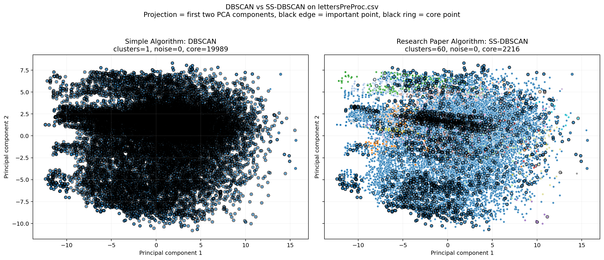
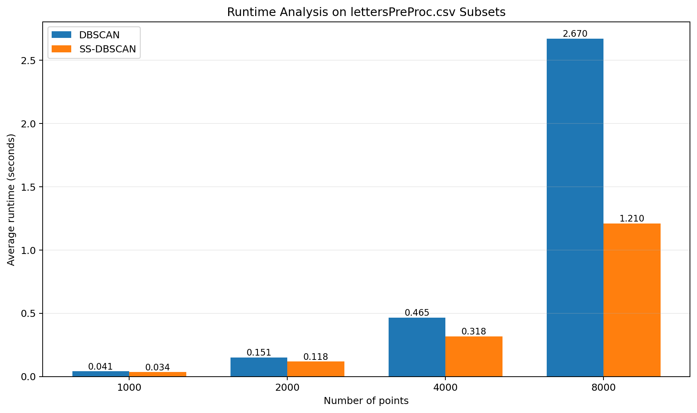

# SS-DBSCAN DWDM Lab Project Report

## 1. Project Objective

This project compares **DBSCAN** with **SS-DBSCAN** using the reference dataset from the public `TibaZaki/SS_DBSCAN` repository: `dataset/lettersPreProc.csv`.

The goal is to reproduce the paper's main idea on a real dataset instead of a synthetic toy example:

- DBSCAN uses density only.
- SS-DBSCAN adds a dataset-specific **importance rule**.
- The comparison shows how this extra condition changes cluster expansion, runtime, and clustering quality.

## 2. Simple Algorithm Description: DBSCAN

DBSCAN is an unsupervised density-based clustering algorithm.

**Main idea**

- For each point, find all neighbors within distance `eps`.
- If the number of neighbors is at least `min_pts`, the point is treated as dense enough to support a cluster.
- Start a cluster from a dense point and expand through neighboring dense points.
- Points reachable from a cluster but not dense enough to expand it behave like border points.
- Points that never join a cluster are labeled as noise.

**Core decision**

```text
neighbor_count(point) >= min_pts
```

**Strengths**

- Does not require the number of clusters in advance.
- Can discover non-spherical cluster shapes.
- Naturally labels outliers as noise.

**Weaknesses**

- Sensitive to `eps` and `min_pts`.
- Can over-merge points when a single global density threshold is not suitable.

## 3. Research Paper Algorithm Description: SS-DBSCAN

SS-DBSCAN keeps the density idea of DBSCAN but injects domain knowledge through an `Is_important(point)` rule.

In the reference implementation style used here:

- A dense seed point can start a cluster.
- During cluster expansion, a neighbor only expands the cluster further if it is both dense and important.

So the expansion rule becomes:

```text
neighbor_count(point) >= min_pts AND Is_important(point) == True
```

This makes SS-DBSCAN **semi-supervised**, because the user defines what kinds of points are meaningful enough to drive expansion.

## 4. Dataset Used in This Project

This project now uses the provided reference dataset:

- File: `dataset/lettersPreProc.csv`
- Rows: `20,000`
- Feature columns: `16`
- Final column: class label
- Number of classes present: `26`

The reference repo describes this file as a preprocessed version of the classic letter-recognition dataset, with the letter mapped to an integer and stored in the last column.

## 5. Importance Rule Used for `lettersPreProc.csv`

To stay consistent with the reference repository, this project uses the same feature-based importance condition for the letters dataset.

Selected feature columns:

- `6, 7, 8, 9, 11, 12, 13, 14, 15, 16`

Project rule:

```text
Is_important(point) = True
if any selected feature is within 2 of that feature's maximum value
```

Equivalent form:

```text
feature_j(point) >= max(feature_j) - 2
for at least one selected feature j
```

This means the project marks a point as important when it is close to an extreme value in at least one of the selected attributes.

## 6. Parameter Difference Table

| Parameter / Concept | DBSCAN | SS-DBSCAN |
|---|---|---|
| `eps` | Required | Required |
| `min_pts` | Required | Required |
| `Is_important(point)` | Not used | Required for expansion |
| Expansion rule | Dense points expand clusters | Dense and important points expand clusters |
| Supervision type | Unsupervised | Semi-supervised |
| Main control idea | Density only | Density + user-defined importance |
| Main risk | One global density threshold may over-merge | Quality depends on the importance rule |
| Worst-case time complexity | `O(n^2)` | `O(n^2)` |

## 7. Theoretical Difference Between Algorithm 1 and Algorithm 2

Here, **Algorithm 1** is simple DBSCAN and **Algorithm 2** is SS-DBSCAN.

| Point of difference | Simple DBSCAN | SS-DBSCAN |
|---|---|---|
| Decision basis | Density neighborhood count only | Density count plus importance-guided expansion |
| Human knowledge | No user knowledge injected | User defines which points are important |
| Cluster growth | Any dense expansion point can continue growth | Only important dense points continue growth |
| Effect on structure | Tends to be governed by global density | Can bias growth toward meaningful regions |
| Core/expansion points | Usually many | Usually fewer |
| Asymptotic runtime | `O(n^2)` | `O(n^2)` |

## 8. Experimental Setup Used in This Project

### Main run configuration

- Dataset: `dataset/lettersPreProc.csv`
- `eps = 8.0`
- `min_pts = 17`
- Distance features: all `16` feature columns
- Importance rule: reference-repo letters rule described above

These are the same parameter values shown in the reference repository example:

```text
python3 SSDBSCAN.py lettersPreProc.csv 8 17 classes.txt
```

### Implementation note

The original toy version of this lab used a full pairwise distance matrix. That approach is too memory-heavy for 20,000 rows, so the current project computes epsilon-neighborhoods in chunks. This preserves the expected `O(n^2)` time behavior while making the full letters dataset run feasible on a normal machine.

## 9. Graph: Simple Algorithm vs Research Paper Algorithm

Run the project:

```bash
python run_project.py
```

Then open:



**How to read the graph**

- Left plot = simple DBSCAN
- Right plot = SS-DBSCAN
- The 16-dimensional dataset is projected to 2D using PCA for visualization only
- Black edge = point satisfies `Is_important`
- Black ring = point was used as an expansion-capable core point

## 10. Measured Results from the Current Run

The latest project run produced the following summary:

| Algorithm | `eps` | `min_pts` | Clusters found | Noise points | Core points | V-measure | ARI | Runtime (s) |
|---|---:|---:|---:|---:|---:|---:|---:|---:|
| DBSCAN | 8.0 | 17 | 1 | 0 | 19,989 | 0.0000 | 0.0000 | 6.996158 |
| SS-DBSCAN | 8.0 | 17 | 60 | 0 | 2,216 | 0.1488 | 0.0042 | 6.652763 |

### Interpretation

- With these parameters, plain DBSCAN collapses the entire dataset into one cluster.
- SS-DBSCAN is much more selective about which dense points continue cluster growth.
- SS-DBSCAN produces many more clusters than DBSCAN and uses far fewer expansion-capable core points.
- The clustering quality metrics are still low, so this run should be treated as a faithful reference-style reproduction, not as a fully tuned best-performing configuration.

## 11. Time Analysis / Runtime Benchmark

Runtime was benchmarked on random subsets of the same letters dataset.



Numeric timings written by the current project run:

| Points | DBSCAN (s) | SS-DBSCAN (s) |
|---:|---:|---:|
| 1,000 | 0.040942 | 0.034088 |
| 2,000 | 0.150909 | 0.117618 |
| 4,000 | 0.464968 | 0.317987 |
| 8,000 | 2.669778 | 1.209715 |

### Runtime observation

- Both algorithms grow roughly quadratically as the dataset size increases.
- On these subset runs, SS-DBSCAN is faster than DBSCAN because the importance condition reduces the number of points that continue expansion.

## 12. Output Files Produced by This Project

After running `python run_project.py`, these files are generated:

- `outputs/metrics_summary.csv`
- `outputs/runtime_summary.csv`
- `outputs/cluster_assignments.csv`
- `outputs/figures/dbscan_vs_ssdbscan.png`
- `outputs/figures/runtime_comparison.png`

`outputs/cluster_assignments.csv` stores, for each row in the dataset:

- original class label
- DBSCAN cluster label
- SS-DBSCAN cluster label
- whether the point is important under the letters rule
- the number of selected features that triggered importance

## 13. How to Run on Python

From the project root:

```bash
python run_project.py
```

If you want to import the algorithms in your own script:

```python
import sys
from pathlib import Path

sys.path.insert(0, str(Path("src").resolve()))
from ssdbscan_lab.algorithms import dbscan, ss_dbscan
from ssdbscan_lab.datasets import load_letters_dataset
```

## 14. Short Conclusion

This project now runs on the real `lettersPreProc.csv` dataset from the reference SS-DBSCAN repository instead of a synthetic demo dataset. DBSCAN uses density alone and, with the reference parameters, merges the data into one cluster. SS-DBSCAN adds a feature-based importance rule and therefore restricts expansion much more strongly, producing a very different clustering structure while keeping the same worst-case `O(n^2)` time complexity.

At the same time, the measured V-measure and ARI show that the current parameter setting is not strongly aligned with the ground-truth class labels. So the project now accurately demonstrates the algorithmic difference on the real dataset, but further parameter tuning would be needed for stronger clustering quality.

## 15. References

1. T. Zaki Abdulhameed, S. A. Yousif, V. W. Samawi, and H. Imad Al-Shaikhli, "SS-DBSCAN: Semi-Supervised Density-Based Spatial Clustering of Applications With Noise for Meaningful Clustering in Diverse Density Data," IEEE Access, vol. 12, pp. 131507-131520, 2024, doi: 10.1109/ACCESS.2024.3457587.
2. Tiba Zaki, `TibaZaki/SS_DBSCAN`, GitHub repository containing `lettersPreProc.csv` and the reference run example `SSDBSCAN.py lettersPreProc.csv 8 17 classes.txt`.
